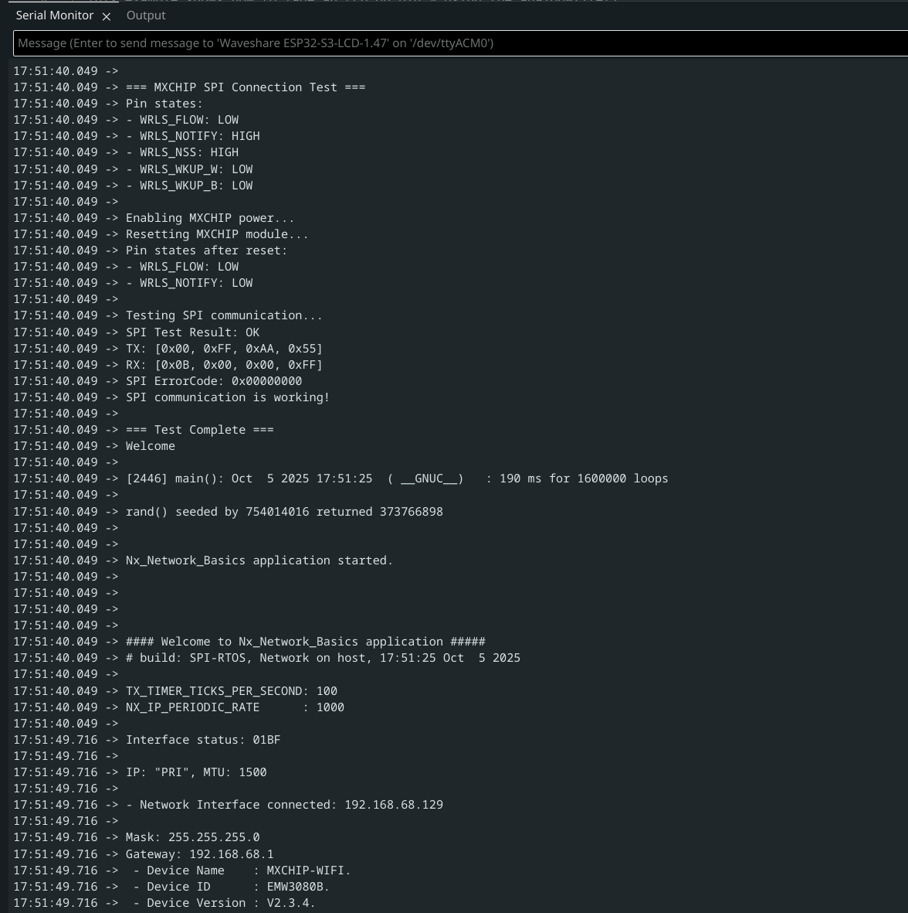

# mxchip + nextduo

## cubemx configuration

- open `Nx_Network_Basics` using STM32CubeMX
- compare the `*.ioc` config to your config in STM32CubeIDE

## build error fix

error

```c
../Drivers/mx_wifi/core/mx_rtos_abs.c:135:24: error: unknown type name 'noos_queue_t'
  135 | int32_t noos_fifo_init(noos_queue_t **qret, uint16_t len)
      |                        ^~~~~~~~~~~~
../Drivers/mx_wifi/core/mx_rtos_abs.c:167:23: error: unknown type name 'noos_queue_t'
  167 | void noos_fifo_deinit(noos_queue_t *q)
      |                       ^~~~~~~~~~~~
```

preprocessor

```
USE_HAL_DRIVER
NX_DRIVER_ENABLE_DEFERRED
USE_THREADX
ENABLE_IOT_INFO
ENABLE_IOT_ERROR
ENABLE_IOT_WARNING
DEBUG
ENABLE_IOT_INFO
NX_BSD_ENABLE_DNS
_SYS_SELECT_H
TX_INCLUDE_USER_DEFINE_FILE
NX_INCLUDE_USER_DEFINE_FILE
STM32U585xx
TX_SINGLE_MODE_NON_SECURE=1
DEBUG
```

in `mx_rtos_abs.h`, add

```c
#if MX_WIFI_USE_CMSIS_OS
#else
  /* No-OS queue structure */
  typedef struct noos_queue_s
  {
    uint16_t len;
    uint16_t in;
    uint16_t idx;
    uint16_t rd;
    uint16_t wr;
    void **fifo;
  } noos_queue_t;

  /* No-OS function declarations */
  int32_t noos_sem_signal(volatile uint32_t *sem);
  int32_t noos_sem_wait(__IO uint32_t *sem, uint32_t timeout, void (*idle_func)(uint32_t duration));
  int32_t noos_fifo_init(noos_queue_t **qret, uint16_t len);
  void noos_fifo_deinit(noos_queue_t *q);
  int32_t noos_fifo_push(noos_queue_t *queue, void *p, uint32_t timeout, void (*idle_func)(uint32_t duration));
  void *noos_fifo_pop(noos_queue_t *queue, uint32_t timeout, void (*idle_func)(uint32_t duration));

#endif /* MX_WIFI_USE_CMSIS_OS */
```

in `mx_wifi_conf.h`, make sure

```c
#define MX_WIFI_USE_CMSIS_OS  0
```

add new include in `mx_rtos_abs.c`

```c
#include "mx_wifi_conf.h"
#include "mx_rtos_abs.h" // NEW
```

if after all that, you got

```c
../Core/Src/main.c:269:(.text.main+0x300): undefined reference to `hardware_rand'
```

add the following in `main.c`

```c
/* Alternative to HAL_RNG_GenerateRandomNumber(). */
/* MX_RNG_Init() MUST be called before usage of this function. */
int hardware_rand(void)
{
  /* Wait for data ready. */
  while ((hrng.Instance->SR & RNG_SR_DRDY) == 0);

  /* Return the random number. */
  return ((int)hrng.Instance->DR);
}
```

## connect to wifi

change the following in `mx_wifi_conf.h`

```c
#define WIFI_SSID                                   "___"
#define WIFI_PASSWORD                               "___"
```


