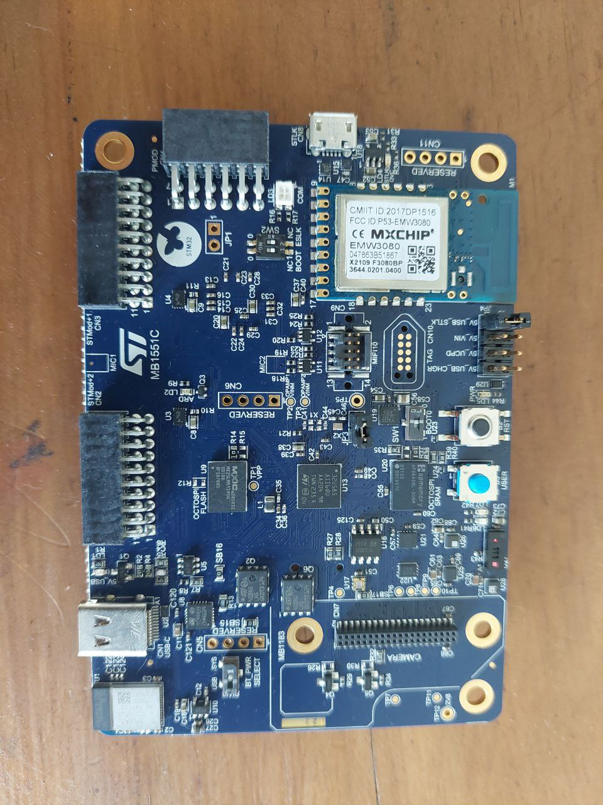
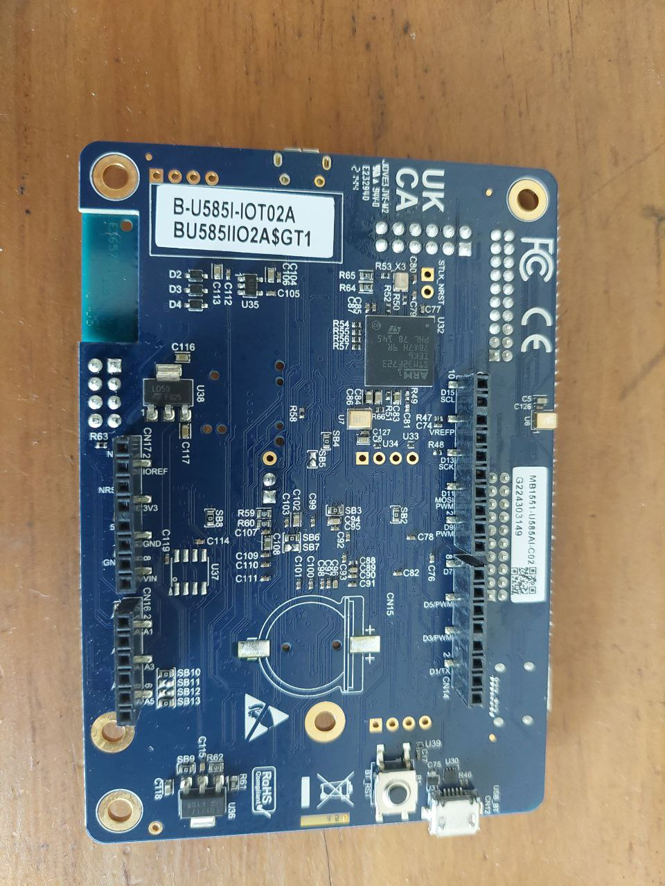

# B-U585I-IOT02A

## drivers

components: https://github.com/STMicroelectronics/STM32CubeU5/tree/main/Drivers/BSP/Components

- EMW3080 -> https://github.com/STMicroelectronics/stm32-mx-wifi
  - https://docs.mxchip.com/en/vgd1r7noe52abqh8/ohlmv1/xstr46.html
- IIS2MDCTR -> https://github.com/STMicroelectronics/stm32-iis2mdc
- ISM330DHCX -> https://github.com/STMicroelectronics/stm32-ism330dhcx/
- LPS22HH -> https://github.com/STMicroelectronics/stm32-lps22hh/
- HTS221 -> https://github.com/STMicroelectronics/stm32-hts221
- VL53L5CXV0GC -> https://github.com/STMicroelectronics/stm32-vl53l5cx
- VEML6030/VEML3235 ->
  - https://github.com/STMicroelectronics/STM32CubeU5/tree/main/Drivers/BSP/Components/veml6030
  - https://github.com/STMicroelectronics/stm32-veml3235/
- STM32-WB-AT -> https://github.com/STMicroelectronics/stm32-wb-at
