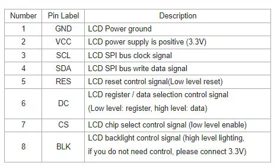
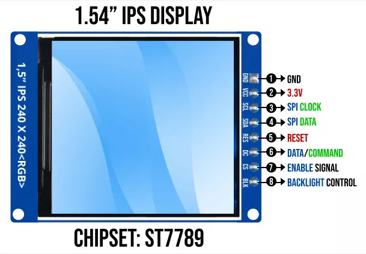

# ST7789

- SCL = SPI Clock (SCLK/SCK) - clock signal
- SDA = SPI Data (MOSI) - Master Out Slave In (data FROM Nucleo TO LCD)
- There is no MISO pin on ST7789 - the display only receives data, it doesn't send data back to the microcontroller

## nucleo connection

- GND -> GND
- VCC -> 3.3V
- SCL -> SCK
- SDA -> MOSI
- RST -> any GPIO pin
- DC -> GPIO pin
- CS -> SPI NSS or any GPIO pin
- BL -> 3.3v (always-on backlight) or PWM-capable GPIO for brightness control
