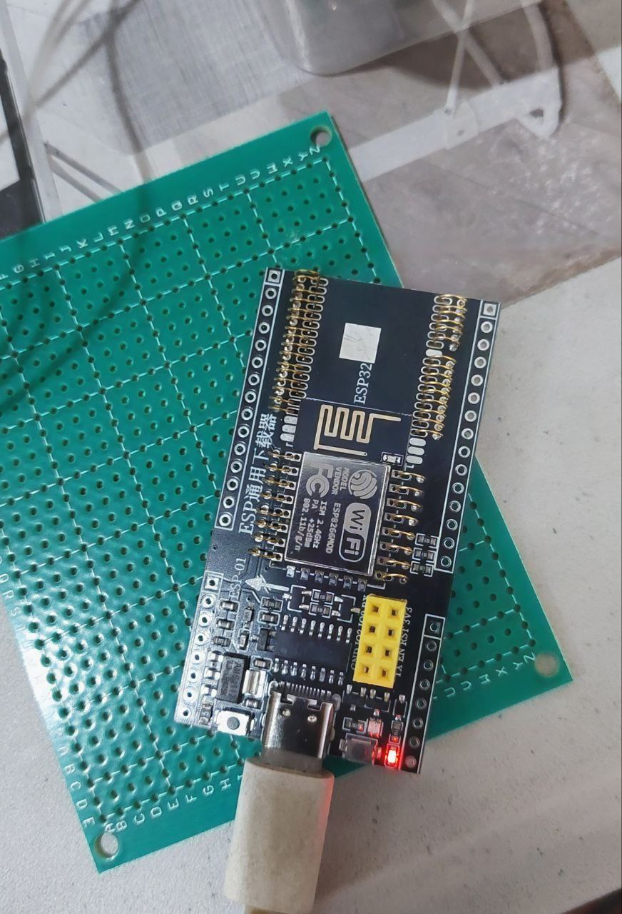
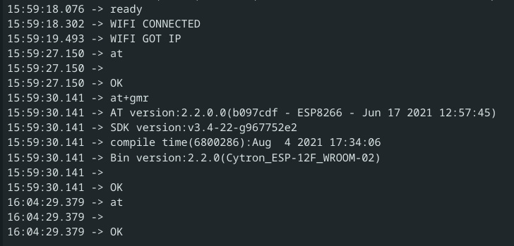

# ESP8266 + ESP32 universal programmer



boot into programming mode by holding BOOT/FLASH, press and release RESET, then release BOOT/FLASH

check the chip

```shell
$  esptool.py --port /dev/ttyUSB3 flash_id
esptool.py v4.8.1
Serial port /dev/ttyUSB3
Connecting....
Detecting chip type... Unsupported detection protocol, switching and trying again...
Connecting....
Detecting chip type... ESP8266
Chip is ESP8266EX
Features: WiFi
Crystal is 26MHz
MAC: xy:xy:xy
Uploading stub...
Running stub...
Stub running...
Manufacturer: d8
Device: 4016
Detected flash size: 4MB
Hard resetting via RTS pin...

```

clone https://github.com/CytronTechnologies/esp-at-binaries/tree/main

```
git clone https://github.com/CytronTechnologies/esp-at-binaries.git
```

flash the chip with the binary

```shell
$ cd esp-at-binaries
$ esptool.py --port /dev/ttyUSB3 --baud 115200 --before default_reset --after hard_reset write_flash --flash_mode dio --flash_freq 40m --flash_size 4MB 0x0 Cytron_ESP-12F_WROOM-02_AT_Firmware_V2.2.0.bin
```


