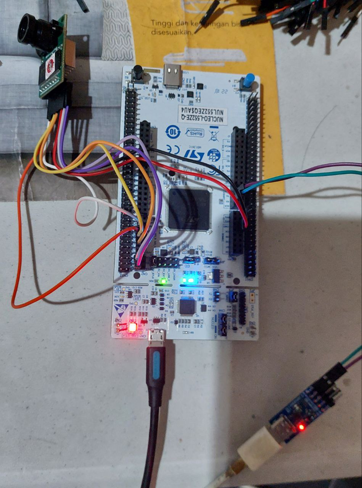
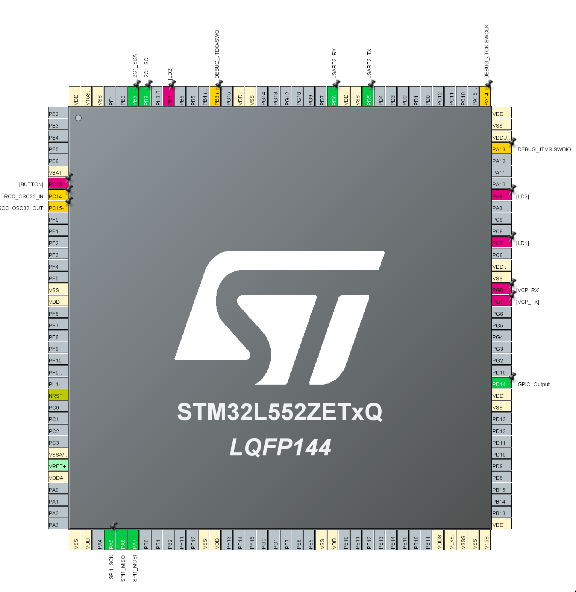

# Nucleo L552RE-Q + Arducam SPI Cam

arducam type is ov5642 (Arducam_MINI_5MP_Plus)

pin connections:

arducam camera

- SDA -> PB9
- SCL -> PB8
- SPI SCK -> PA5
- SPI MISO -> PA6
- SPI MOSI -> PA7
- SPI CS -> PD14 (output)

usb to ttl

- PD6 RX -> TX
- PD5 TX -> RX

