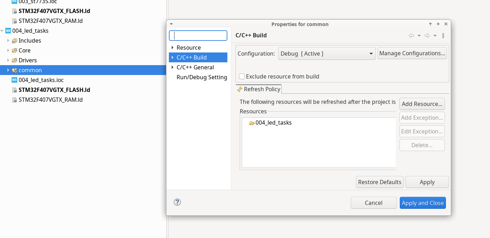
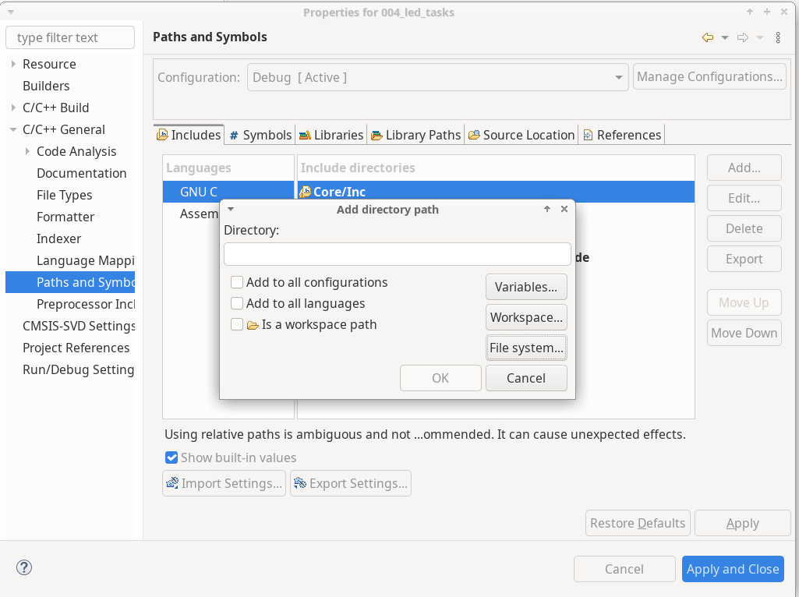
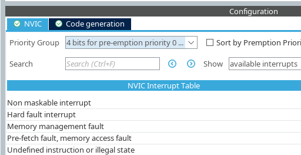

# STM32F4DISCOVERY

https://www.st.com/en/evaluation-tools/stm32f4discovery.html

## freertos

- download here: https://github.com/FreeRTOS/FreeRTOS-Kernel
- stm32f4 freertos config sample: https://github.com/FreeRTOS/FreeRTOS/blob/main/FreeRTOS/Demo/CORTEX_M4F_STM32F407ZG-SK/FreeRTOSConfig.h
- API references: https://www.freertos.org/Documentation/02-Kernel/04-API-references/01-Task-creation/01-xTaskCreate
- FreeRTOS with SystemView: https://kb.segger.com/FreeRTOS_with_SystemView

### SystemView

https://www.segger.com/downloads/systemview/

get the following:

- the SystemView application
- SystemView Target Sources
- SystemView User Manual

### share thirdParty

- create folder `common`
- copy `ThirdParty` folder from `002_freertos_manual`
- drag folder `common` to `004_led_tasks`

- choose `Link to files and folder`
- uncheck `Exclude resource from build`

- `File System`

- priority group is set to `4 bits for pre-emption ....`

- don't generate systick, pendsv, svc handler

