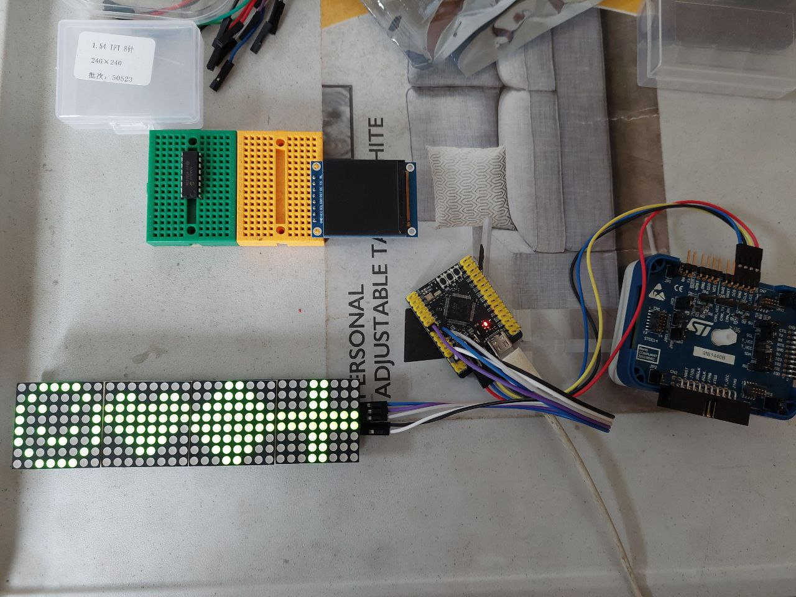

# MAX7219

MAX7219 pins:

- vcc
- gnd
- DIN
- CS
- CLK

SPI pin connection:

- PA5 (SCK) -> CLK
- PA6 (MISO) -> (not used)
- PA7 (MOSI) -> DIN
- PA4 (NSS) -> CS

USART1 pin connection:

- PA10 (USART1_RX) ->
- PA9 (USART1_TX) ->

