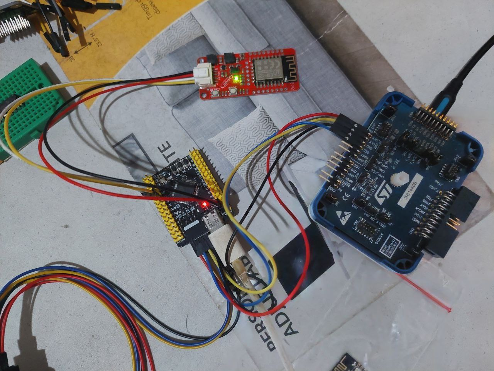

# STM32 + cytron-grove-wifi-8266

- UART DMA: https://controllerstech.com/stm32-uart-4-receive-data-using-dma/
- esp8266 wifi ip: https://controllerstech.com/stm32-esp8266-wifi-ip/

pin connection:

- VCC -> 5V on board
- GND -> GND
- TX -> PA1
- RX -> PA0

the correct expected logs if failed to connect

