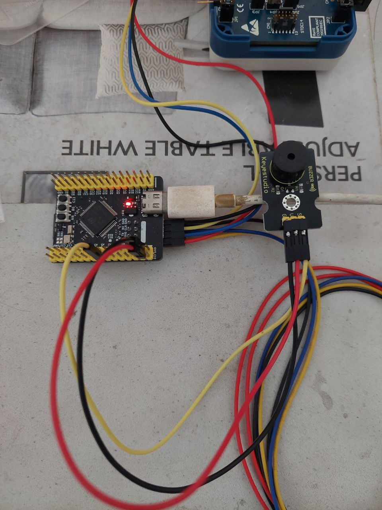

# passive buzzer

- S -> PA5 PWM
- V -> 3.3V
- G -> GND

1. Cricket pattern: 3 quick chirps -> pause -> repeat
2. Frequency: 4.5 kHz
3. Timing: 50ms chirp, 100ms pause between chirps, 800ms pause between bursts

