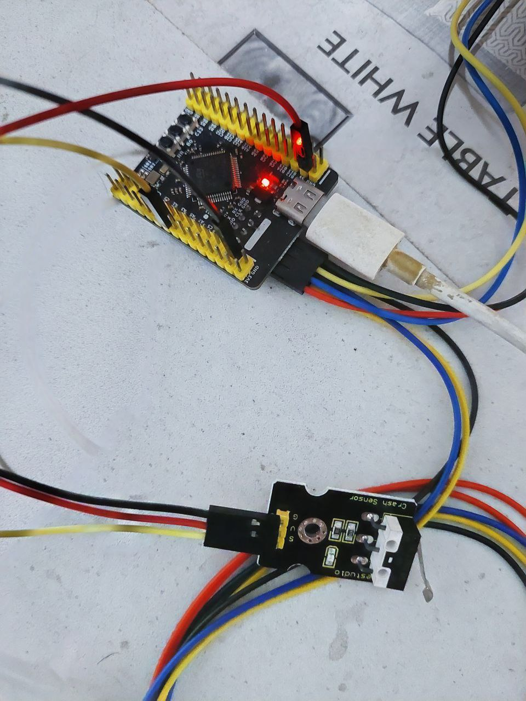
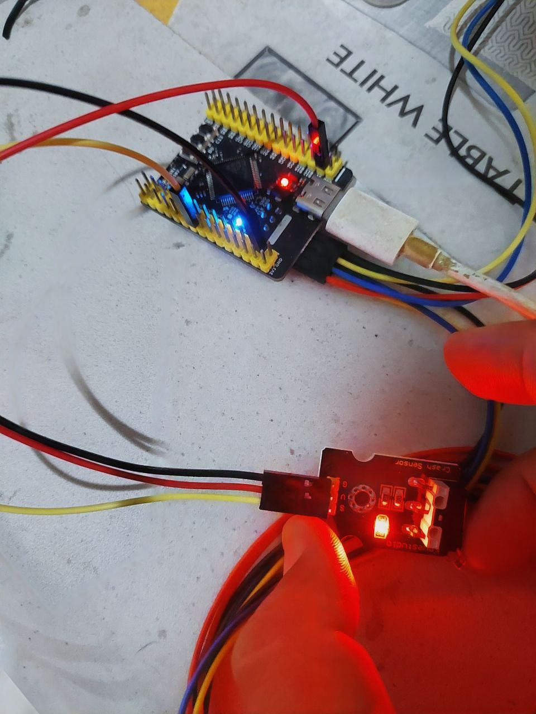

# collision flash

pin

- V -> 5V
- G -> GND
- S -> PA4 input

Description:

Crash sensor, also known as electronic switch, is a digital on-off input module necessary for elementary electronic learning. By programming, it can realize to control over light, sound device, key choice function of LCD display, etc. Using 3P sensor cable to connect it to sensor shield, it can be installed to 4WD AL alloy mobile robot platform to realize collision detection function. It is both convenient and efficient. Note:You can make a collision flasher using collision module and built-in LED on interface 13. Connect the collision sensor to pin 3. When the collision sensor senses a collision signal, the LEDs on both mainboard and module will light up simultaneously.

Parameters:

If collision happens upfront of where collision module is installed, module outputs low level signal; no collision, outputs high level signal. Module reserves M3 mounting hole, convenient for fixation on a car. Module size: 3.1cm \* 2.1cm With switch indicator light, if there is collision, light is on; no collision, light is off. Pin definition: 1.Positive pin (+): connect to 3v-12v power supply 2.Negative pin (-): connect to GND 3.Signal pin (S): connect to High-low level output

before

after collision

