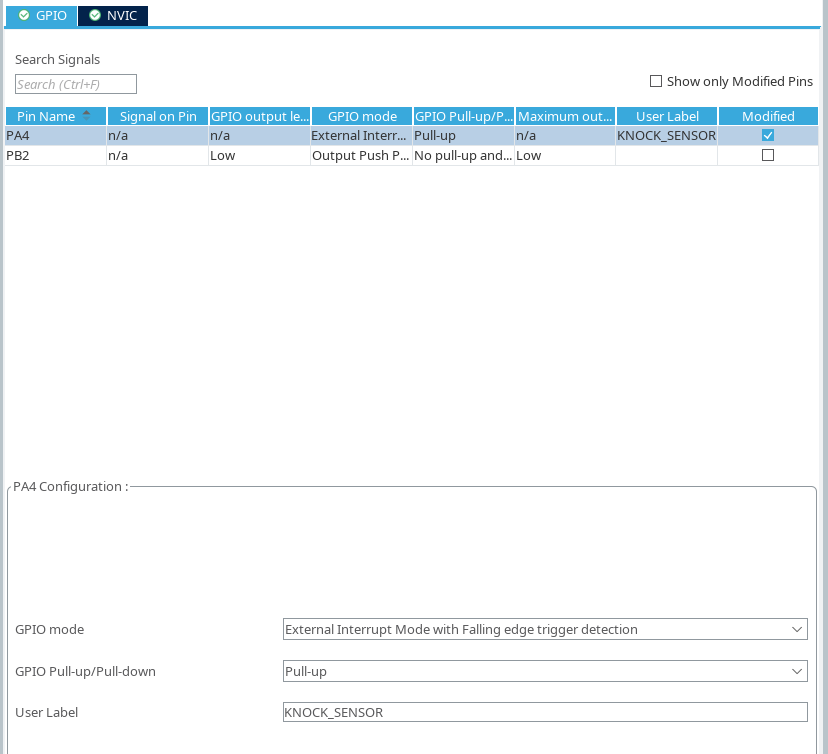
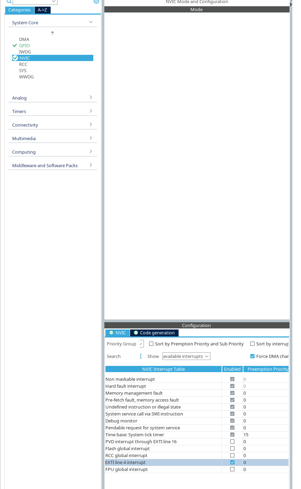

# knock sensor

pin

- V -> 5V
- G -> GND
- S -> PA4
  - external interrupt mode with falling edge trigger detection

GPIO config



in NVIC, enable `EXTI line 4 interrupt`



The Keyestudio knock sensor typically outputs:

- HIGH (3.3V or 5V) - Normal state (no knock detected)
- LOW (0V) - When knock is detected

So the signal transition is: HIGH -> LOW (falling edge) when a knock occurs.

```
Voltage
  |
5V|  ████████████╗                    ╔════════
  |              ║                    ║
  |              ║  ← Knock happens   ║
0V|              ╚════════════════════╝
  |______________|____________________|_________> Time
                 ↑                    ↑
           Falling Edge          Rising Edge
         (Knock detected)      (Back to normal)
```
