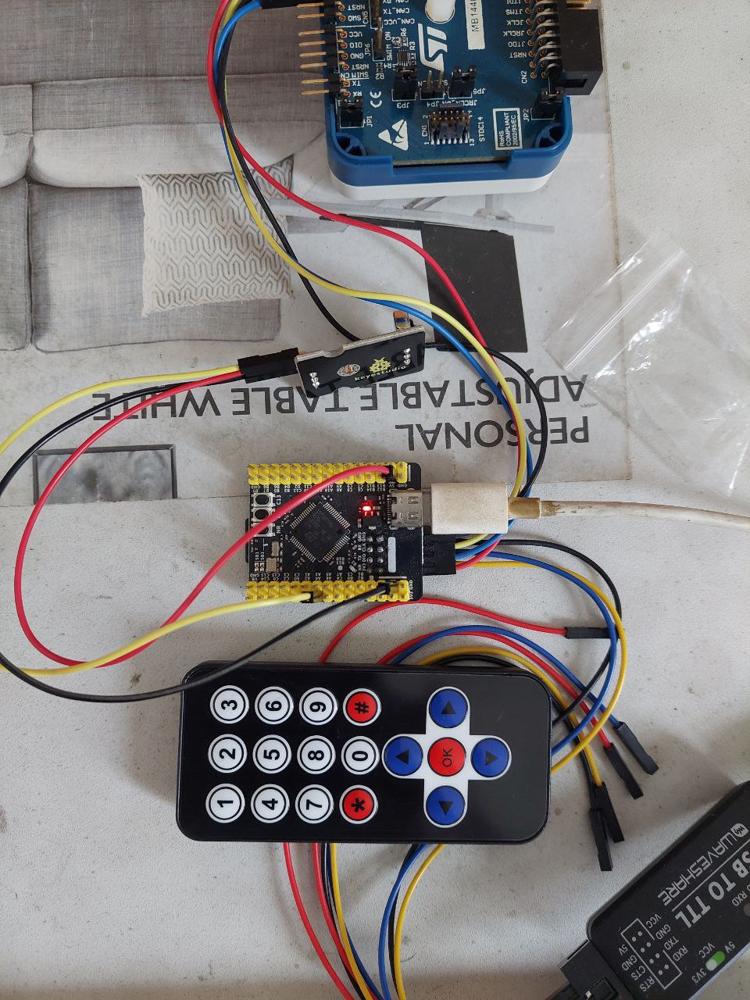
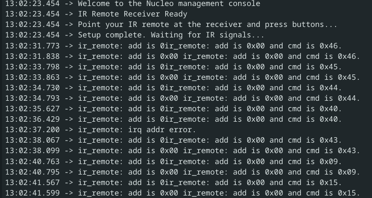

# IR Receiver

pin

- V -> 5V
- G -> GND
- S -> PA4

## microsecond-precise timing using DWT (Data Watchpoint and Trace) cycle counter

- DWT Cycle Counter: A hardware counter that increments every CPU clock cycle
- 16 MHz clock: Your STM32F4 is running at 16 MHz (HSI), so 16 cycles = 1 microsecond
- Accumulation: Tracks total elapsed microseconds between calls

in `main.c`

```c
    /* USER CODE BEGIN 2 */
    RingBuffer_Init(&txBuf);
    RingBuffer_Init(&rxBuf);

    CoreDebug->DEMCR |= CoreDebug_DEMCR_TRCENA_Msk;
    DWT->CYCCNT = 0;
    DWT->CTRL |= DWT_CTRL_CYCCNTENA_Msk;
```

in `ir_remote_interface.c`

```c
#include "ir_remote_interface.h"
#include "main.h"
#include <stdarg.h>
#include <stdio.h>

extern UART_HandleTypeDef huart1;

/**
 * @brief     interface timestamp read
 * @param[in] *t pointer to an ir_remote_time structure
 * @return    status code
 *            - 0 success
 *            - 1 read failed
 * @note      none
 */
uint8_t ir_remote_interface_timestamp_read(ir_remote_time_t *t)
{
    static uint32_t last_cycles = 0;
    static uint64_t total_us = 0;

    // Get current cycle count
    uint32_t current_cycles = DWT->CYCCNT;

    // Calculate cycles elapsed (handles overflow)
    uint32_t cycles_elapsed;
    if (current_cycles >= last_cycles)
    {
        cycles_elapsed = current_cycles - last_cycles;
    }
    else
    {
        cycles_elapsed = (0xFFFFFFFF - last_cycles) + current_cycles + 1;
    }

    // Convert cycles to microseconds (assuming 16 MHz HSI clock)
    // cycles / (cycles_per_second / 1000000) = microseconds
    uint32_t us_elapsed = cycles_elapsed / 16;  // 16 MHz = 16 cycles per microsecond

    total_us += us_elapsed;
    last_cycles = current_cycles;

    t->s = total_us / 1000000;
    t->us = total_us % 1000000;

    return 0;
}
```

## using TIM2

`main.c`

```shell
static void MX_TIM2_Init(void)
{

  /* USER CODE BEGIN TIM2_Init 0 */

  /* USER CODE END TIM2_Init 0 */

  TIM_ClockConfigTypeDef sClockSourceConfig = {0};
  TIM_MasterConfigTypeDef sMasterConfig = {0};

  /* USER CODE BEGIN TIM2_Init 1 */

  /* USER CODE END TIM2_Init 1 */
  htim2.Instance = TIM2;
  htim2.Init.Prescaler = 15;
  htim2.Init.CounterMode = TIM_COUNTERMODE_UP;
  htim2.Init.Period = 4294967295;
  htim2.Init.ClockDivision = TIM_CLOCKDIVISION_DIV1;
  htim2.Init.AutoReloadPreload = TIM_AUTORELOAD_PRELOAD_DISABLE;
  if (HAL_TIM_Base_Init(&htim2) != HAL_OK)
  {
    Error_Handler();
  }
  sClockSourceConfig.ClockSource = TIM_CLOCKSOURCE_INTERNAL;
  if (HAL_TIM_ConfigClockSource(&htim2, &sClockSourceConfig) != HAL_OK)
  {
    Error_Handler();
  }
  sMasterConfig.MasterOutputTrigger = TIM_TRGO_RESET;
  sMasterConfig.MasterSlaveMode = TIM_MASTERSLAVEMODE_DISABLE;
  if (HAL_TIMEx_MasterConfigSynchronization(&htim2, &sMasterConfig) != HAL_OK)
  {
    Error_Handler();
  }
  /* USER CODE BEGIN TIM2_Init 2 */
  if (HAL_TIM_Base_Start(&htim2) != HAL_OK)
  {
	  Error_Handler();
  }
  /* USER CODE END TIM2_Init 2 */

}
```

in `ir_remote_interface.c`

```c
#include "ir_remote_interface.h"
#include "main.h"
#include <stdarg.h>
#include <stdio.h>

extern UART_HandleTypeDef huart1;
extern TIM_HandleTypeDef htim2;

/**
 * @brief     interface timestamp read
 * @param[in] *t pointer to an ir_remote_time structure
 * @return    status code
 *            - 0 success
 *            - 1 read failed
 * @note      none
 */
uint8_t ir_remote_interface_timestamp_read(ir_remote_time_t *t)
{
    static uint32_t last_ticks = 0;
    static uint64_t total_us = 0;

    uint32_t current_ticks = __HAL_TIM_GET_COUNTER(&htim2);

    // Calculate elapsed ticks (handles overflow)
    uint32_t ticks_elapsed;
    if (current_ticks >= last_ticks)
    {
        ticks_elapsed = current_ticks - last_ticks;
    }
    else
    {
        ticks_elapsed = (0xFFFFFFFF - last_ticks) + current_ticks + 1;
    }

    total_us += ticks_elapsed;
    last_ticks = current_ticks;

    t->s = total_us / 1000000;
    t->us = total_us % 1000000;

    return 0;
}
```

## photos



result


