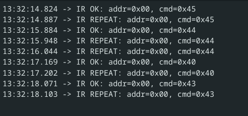

# IR Receiver

pin

- V -> 5V
- G -> GND
- S -> PA4

microsecond-precise timing using DWT (Data Watchpoint and Trace) cycle counter:

- DWT Cycle Counter: A hardware counter that increments every CPU clock cycle
- 16 MHz clock: Your STM32F4 is running at 16 MHz (HSI), so 16 cycles = 1 microsecond
- Accumulation: Tracks total elapsed microseconds between calls

result

