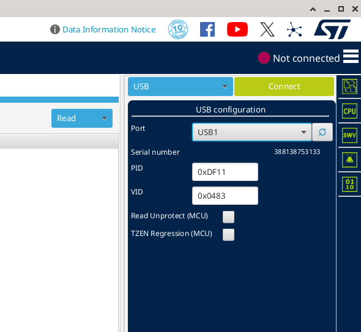

# problems with this board

## enter into DFU mode (linux issue)

- hold down BO button
- connect to PC
- release BO

if done right, you could see `lsusb`

```shell
Bus 003 Device 008: ID 0483:df11 STMicroelectronics STM Device in DFU Mode
```

if STM32CubeProgrammer can't detect it, it's probably USB permission issue

create new `udev` rule

```shell
cd /etc/udev/rules.d/
sudo vim 49-stm32-dfu-mode.rules
```

add this line

```
SUBSYSTEM=="usb", ATTRS{idVendor}=="0483", ATTRS{idProduct}=="df11", MODE="0666"
```

then reload udev rules

```bash
sudo udevadm control --reload-rules
sudo udevadm trigger
```

Unplug and replug your board, then try STM32CubeProgrammer again.

result image


