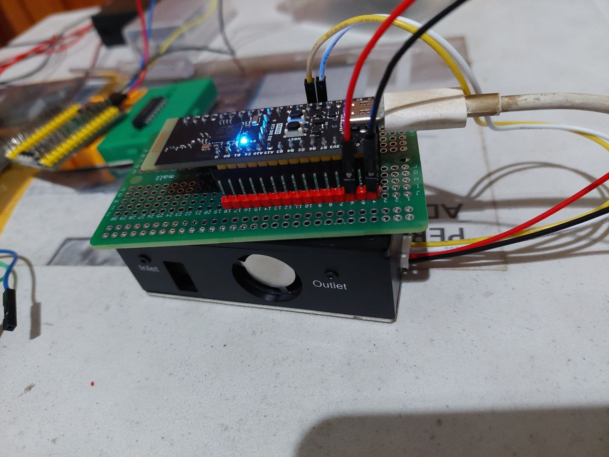
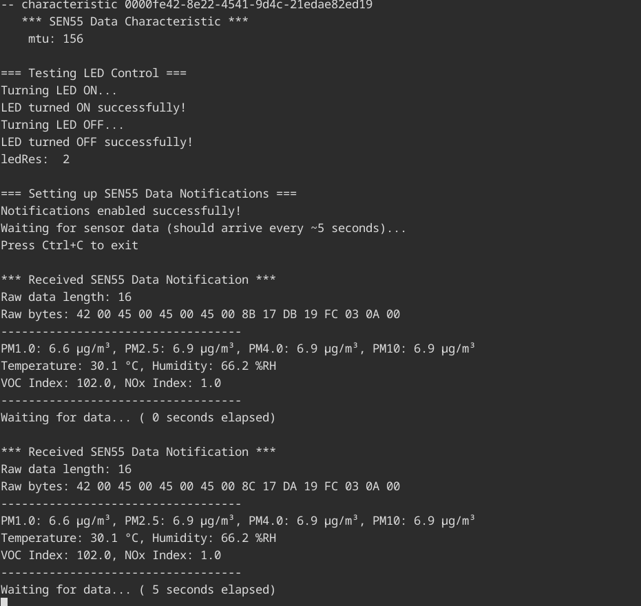

# notify SEN55 data and read-write board LED

- seeed studio SEN55
- waveshare USB to TTL

## connection:

PB7 (TX) --> waveshare RX \
PB6 (RX) --> waveshare TX

PE4 -> board LED

PB8 (SCL) --> yellow cable (SCL) \
PB9 (SDA) --> white cable (SDA)



## reading data

see `stm32-projects/applications/sen55-reader` on how to read SEN55 data



## a bit of explanation

in `weact-stm32wb/004_sen55_ble_app/STM32_WPAN/App/custom_app.c`

```c
void Custom_Sen55_c_Send_Notification(void) /* Property Notification */
{
  uint8_t updateflag = 0;

  /* USER CODE BEGIN Sen55_c_NS_1*/
  if (Custom_App_Context.Sen55_c_Notification_Status)
  {
	  sen55_data_t sensor_data;

	  // read sensor data
	  if (SEN55_ReadAllData(&sensor_data) == HAL_OK) {
		  updateflag = 1;

		  // pack sensor data into notification buffer
		  // format: [PM1.0(2)] [PM2.5(2)] [PM4.0(2)] [PM10(2)] [Temp(2)] [Hum(2)] [VOC(2)] [NOx(2)]
		  NotifyCharData[0] = (uint8_t)(sensor_data.pm1_0 & 0xFF);
		  NotifyCharData[1] = (uint8_t)(sensor_data.pm1_0 >> 8);
		  NotifyCharData[2] = (uint8_t)(sensor_data.pm2_5 & 0xFF);
		  NotifyCharData[3] = (uint8_t)(sensor_data.pm2_5 >> 8);
		  NotifyCharData[4] = (uint8_t)(sensor_data.pm4_0 & 0xFF);
		  NotifyCharData[5] = (uint8_t)(sensor_data.pm4_0 >> 8);
		  NotifyCharData[6] = (uint8_t)(sensor_data.pm10 & 0xFF);
		  NotifyCharData[7] = (uint8_t)(sensor_data.pm10 >> 8);
		  NotifyCharData[8] = (uint8_t)(sensor_data.temperature & 0xFF);
		  NotifyCharData[9] = (uint8_t)(sensor_data.temperature >> 8);
		  NotifyCharData[10] = (uint8_t)(sensor_data.humidity & 0xFF);
		  NotifyCharData[11] = (uint8_t)(sensor_data.humidity >> 8);
		  NotifyCharData[12] = (uint8_t)(sensor_data.voc_index & 0xFF);
		  NotifyCharData[13] = (uint8_t)(sensor_data.voc_index >> 8);
		  NotifyCharData[14] = (uint8_t)(sensor_data.nox_index & 0xFF);
		  NotifyCharData[15] = (uint8_t)(sensor_data.nox_index >> 8);

		  APP_DBG_MSG("-- CUSTOM APPLICATION SERVER : SENDING SEN55 DATA\n");
		  APP_DBG_MSG("PM1.0: %.1f µg/m³, PM2.5: %.1f µg/m³\n",
				  sensor_data.pm1_0 / 10.0f, sensor_data.pm2_5 / 10.0f);
		  APP_DBG_MSG("Temperature: %.1f °C, Humidity: %.1f %%RH\n",
				  sensor_data.temperature / 200.0f, sensor_data.humidity / 100.0f);
	  } else {
		  APP_DBG_MSG("-- CUSTOM APPLICATION : ERROR READING SEN55 DATA\n");
	  }
  }
  else
  {
	  APP_DBG_MSG("-- CUSTOM APPLICATION : CAN'T INFORM CLIENT -  NOTIFICATION DISABLED\n");
  }
  /* USER CODE END Sen55_c_NS_1*/

  if (updateflag != 0)
  {
    Custom_STM_App_Update_Char(CUSTOM_STM_SEN55_C, (uint8_t *)NotifyCharData);
  }

  /* USER CODE BEGIN Sen55_c_NS_Last*/

  /* USER CODE END Sen55_c_NS_Last*/

  return;
}
```

BLE sends data as an array of bytes (uint8_t), but SEN55 data contains 16-bit values (uint16_t and int16_t). We need to split each 16-bit value into two 8-bit bytes.

Say `sensor_data.pm1_0 = 1234` (which represents 123.4 µg/m³).

In binary: `1234 = 0000 0100 1101 0010` (16 bits)

We need to split this into:

- **Low byte** (LSB): `1101 0010` = 210 decimal
- **High byte** (MSB): `0000 0100` = 4 decimal

### the bit operations

```c
NotifyCharData[0] = (uint8_t)(sensor_data.pm1_0 & 0xFF);    // Low byte
NotifyCharData[1] = (uint8_t)(sensor_data.pm1_0 >> 8);      // High byte
```

> https://www.rapidtables.com/calc/math/binary-calculator.html?num1=0000010011010010&op=5&num2=11111111

`& 0xFF` (Bitwise AND with 255)

- `0xFF` in binary is `1111 1111` (8 ones)
- This operation keeps only the **lower 8 bits** and sets the upper bits to 0
- Example: `1234 & 0xFF = 210` (keeps only the low byte)

`>> 8` (Right Shift by 8 bits)

- Shifts all bits 8 positions to the right
- This moves the **upper 8 bits** to the lower position
- Example: `1234 >> 8 = 4` (the high byte becomes the low byte)

### complete data layout

The 16 bytes in `NotifyCharData[]` are organized like this:

```
Byte Index | Data          | Description
-----------|---------------|------------------
0-1        | PM1.0         | [Low][High] bytes
2-3        | PM2.5         | [Low][High] bytes
4-5        | PM4.0         | [Low][High] bytes
6-7        | PM10          | [Low][High] bytes
8-9        | Temperature   | [Low][High] bytes
10-11      | Humidity      | [Low][High] bytes
12-13      | VOC Index     | [Low][High] bytes
14-15      | NOx Index     | [Low][High] bytes
```
