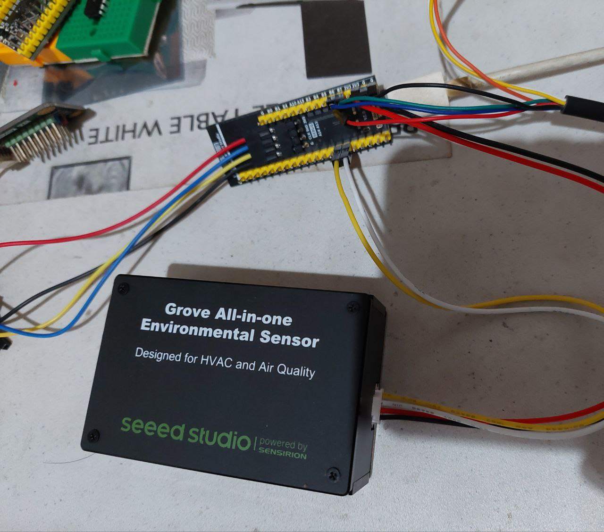

# notify SEN55 data and read-write board LED

- seeed studio SEN55
- waveshare USB to TTL

## connection:

PB7 (TX) --> waveshare RX \n
PB6 (RX) --> waveshare TX

PE4 -> board LED

PB8 (SCL) --> yellow cable (SCL) \n
PB9 (SDA) --> white cable (SDA)

