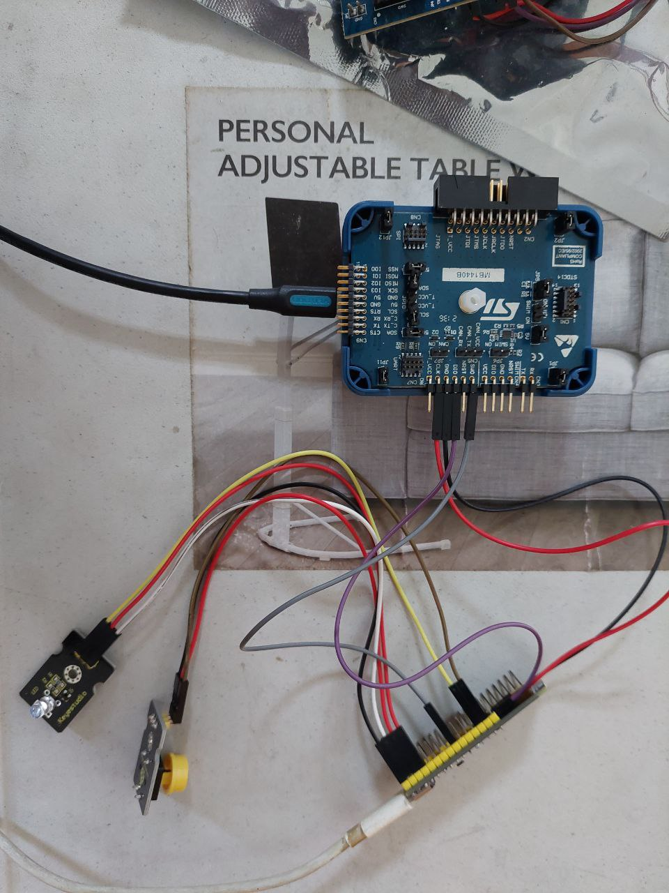
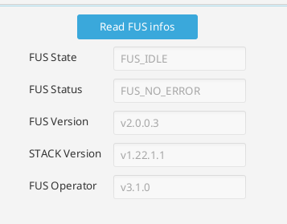
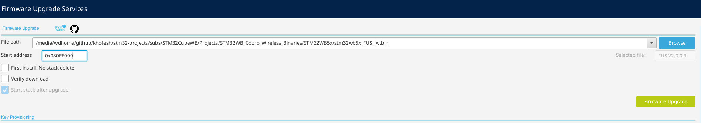
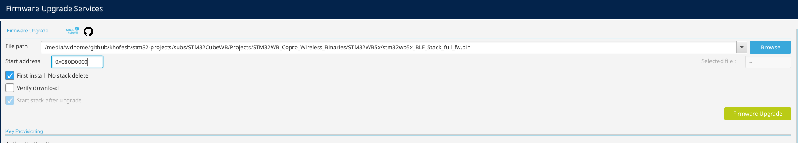

# WeActStudio.STM32WB55CoreBoard

development using STLINK V3SET

## Update FUS to v2 and update bluetooth LE stack

full explanation in https://wiki.st.com/stm32mcu/wiki/Connectivity:STM32WB_BLE_Hardware_Setup

the files needed in `subs/STM32CubeWB/Projects/STM32WB_Copro_Wireless_Binaries/STM32WB5x`

FUS: stm32wb5x_FUS_fw.bin \
BLE stack: stm32wb5x_BLE_Stack_full_fw.bin

Update FUS

Update BLE stack

you could get the start address `0x080D0000` in `Release_Notes.html`
